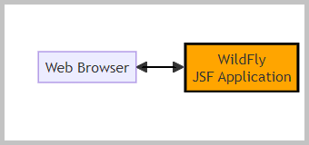

<!DOCTYPE html>
<HTML lang="en">
<META charset="UTF-8">
<BODY>

<H2 id="contents">Study14 README Contents</H2>

<h3 id="top">Research JAX-WS and JAX-RS</h3>

 

<I>The flowchart with the WildFly application.</I>

<table style="border:solid"><tbody>
<tr><td style="border:solid">
<a href="https://javaee.github.io/metro-jax-ws/">Java API for XML-Based Web Services (JAX-WS)</a>
</td></tr><tr><td style="border:solid">
<a href="https://github.com/jakartaee/rest">Jakarta RESTful Web Services (JAX-RS)</a>
</td></tr>
</tbody></table>

The sections of this project:

<OL>
<LI><A href="#wildfly">WildFly Application Deploy</A></LI>
<LI><A href="#w_s">XML-Based Web Services</A></LI>
<LI><A href="#r_s">RESTful Web Services</A></LI>
</OL>

Java source code. Packages in modules 'common', 'ejb', 'web': 
 
 module 'common' application sources: 
<a href="https://github.com/k1729p/Study14/tree/master/common/src/main/java/kp/">kp</a> 
 module 'ejb' application sources: 
	<a href="https://github.com/k1729p/Study14/tree/master/ejb/src/main/java/kp">kp</a> 
 module 'web' application sources: 
	<a href="https://github.com/k1729p/Study14/tree/master/web/src/main/java/kp/">kp</a> 

 

    <a href="http://htmlpreview.github.io/?https://github.com/k1729p/Study14/blob/main/docs/apidocs/index.html">
	Java API Documentation</a> 

<a href="#top">Back to the top of the page</a>

<H2 id="wildfly">❶ WildFly Application Deploy</H2>

Action: 
 
 1. With the batch file 
<a href="https://github.com/k1729p/Study14/blob/main/0_batch/01%20WildFly%20DeleteLog%20Startup.bat"> 
<I>"01 WildFly DeleteLog Startup.bat"</I></a> start the WildFly server. 
 2. With the batch file 
<a href="https://github.com/k1729p/Study14/blob/main/0_batch/02%20MVN%20clean%20install%20deploy%20WildFly.bat"> 
<I>"02 MVN clean install deploy WildFly.bat"</I></a> build and deploy the application 
on the WildFly server. 
 3. With the URL <a href="http://localhost:8080/Study14/">http://localhost:8080/Study14/</a> 
open in the web browser the '<i>home page</i>'. 

 
1.1. The '<i>home page</i>' file <b>index.html</b>: 
<a href="https://github.com/k1729p/Study14/blob/main/web/src/main/webapp/index.html">HTML code</a>, 
<a href="http://htmlpreview.github.io/?https://github.com/k1729p/Study14/blob/main/web/src/main/webapp/index.html">
HTML preview</a>

 

<I>The screenshot of the home page.</I>

 
1.2. The link to the WildFly Application Server <a href="http://localhost:8080/console">Administration Console</a>.

<a href="#top">Back to the top of the page</a>

<H2 id="w_s">❷ XML-Based Web Services</H2>

Action: 
 
 1. Go to page <a href="http://localhost:8080/Study14/">http://localhost:8080/Study14/</a> 
 2. Select the link <a href="http://localhost:8080/Study14/w_s.xhtml">'Web Services'</a>. 
 3. On this 'Web Services' page push the button "Web Service". 

 

<I>Screenshot from 'Web Services' page controls.</I>

The JSF page on the screenshot 
<a href="https://github.com/k1729p/Study14/blob/main/web/src/main/webapp/w_s.xhtml">'w_s.xhtml'</a> uses the bean 
<a href="https://github.com/k1729p/Study14/blob/main/web/src/main/java/kp/w_s/controller/WsManagedBean.java">'WsManagedBean'</a>.

 
2.1. On the 'Web Services' page there are three links to the WSDL files:

<ul>
<li>link <a href="http://localhost:8080/Study14_ejb/WebSeImplA?wsdl">'WebSeImplA WSDL'</a> 
(the <a href="images/ScreenshotWsdlWebSeImplA.png">screenshot</a> of the received WSDL file)</li>
<li>link <a href="http://localhost:8080/Study14_ejb/WebSeImplB?wsdl">'WebSeImplB WSDL'</a> 
(the <a href="images/ScreenshotWsdlWebSeImplB.png">screenshot</a> of the received WSDL file)</li>
<li>link <a href="http://localhost:8080/Study14_ejb/WebSeImplC?wsdl">'WebSeImplC WSDL'</a> 
(the <a href="images/ScreenshotWsdlWebSeImplC.png">screenshot</a> of the received WSDL file)</li>
</ul>

 
2.2. The button "Web Service" executes the method 
<a href="https://github.com/k1729p/Study14/blob/main/web/src/main/java/kp/w_s/controller/WsManagedBean.java#L48">
'WsManagedBean::researchWebService'</a>.

The web service endpoint <a href="https://github.com/k1729p/Study14/blob/main/common/src/main/java/kp/w_s/WebSe.java">'WebSe'</a>
is implemented as a <b>stateless</b> session bean:

<ul>
<li><a href="https://github.com/k1729p/Study14/blob/main/ejb/src/main/java/kp/w_s/WebSeImplA.java">'WebSeImplA'</a></li>
<li><a href="https://github.com/k1729p/Study14/blob/main/ejb/src/main/java/kp/w_s/WebSeImplB.java">'WebSeImplB'</a></li>
<li><a href="https://github.com/k1729p/Study14/blob/main/ejb/src/main/java/kp/w_s/WebSeImplC.java">'WebSeImplC'</a></li>
</ul>

The web service implementation is created from the WSDL document in the method
<a href="https://github.com/k1729p/Study14/blob/main/common/src/main/java/kp/util/Tools.java#L70">Tools::createWebSeImpl</a>.

 

<I>Screenshot from 'Web Service' action.</I>

<a href="#top">Back to the top of the page</a>

<H2 id="r_s">❸ RESTful Web Services</H2>

Action: 
 
 1. Go to page <a href="http://localhost:8080/Study14/">http://localhost:8080/Study14/</a> 
 2. Select the link <a href="http://localhost:8080/Study14/r_s.xhtml">'RESTful Web Services'</a>. 
 3. On this 'RESTful Web Services' page push the button "RESTful Web Service". 
 4. On this 'RESTful Web Services' page click the link 
<a href="http://localhost:8080/Study14/rs/text/">'RESTful Web Service'</a>. 

 

<I>Screenshot from "RESTful Web Services" page controls.</I>

The JSF page on the screenshot 
<a href="https://github.com/k1729p/Study14/blob/main/web/src/main/webapp/r_s.xhtml">'r_s.xhtml'</a> uses the bean 
<a href="https://github.com/k1729p/Study14/blob/main/web/src/main/java/kp/r_s/controller/RsManagedBean.java">'RsManagedBean'</a>.

 
3.1. The button "RESTful Web Service" executes the method 
<a href="https://github.com/k1729p/Study14/blob/main/web/src/main/java/kp/r_s/controller/RsManagedBean.java#L46">
'RsManagedBean::researchRestfulWebService'</a>. 
The stateless session bean  <a href="https://github.com/k1729p/Study14/blob/main/web/src/main/java/kp/r_s/ReSe.java">'ReSe'</a>. 
The GET method <a href="https://github.com/k1729p/Study14/blob/main/web/src/main/java/kp/r_s/ReSe.java#L44">'ReSe::getText'</a>
for the service endpoint <a href="http://localhost:8080/Study14/rs/text/">'http://localhost:8080/Study14/rs/text/'</a>.

 

<I>Screenshot from 'RESTful Web Service' button action.</I>

 

<I>Screenshot from 'RESTful Web Service' link action.</I>

<a href="#top">Back to the top of the page</a>

</BODY>
</HTML>